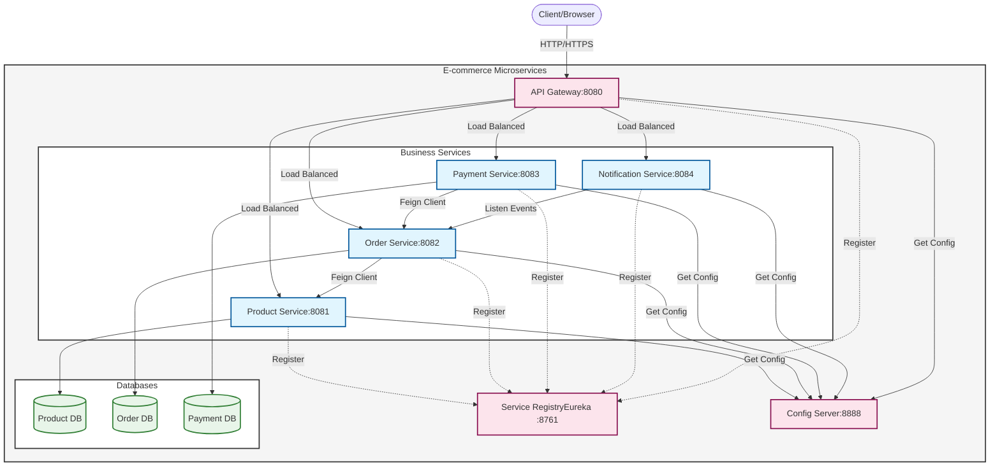

# E-commerce Microservices Project

## Overview
Modern e-commerce system built with microservices architecture using Spring Cloud. This project demonstrates the implementation of scalable, resilient, and loosely coupled services.

## Architecture



### Service Interaction
- **Client** makes requests through the **API Gateway**
- **Gateway** routes requests to appropriate services
- All services register with **Eureka** for service discovery
- Services fetch configuration from **Config Server**
- **Order Service** communicates with **Product Service** using Feign Client
- **Payment Service** validates orders through **Order Service**
- **Notification Service** listens to events from **Order Service**

### Services
- **Service Registry (Eureka)**: Service discovery and registration
- **Config Server**: Centralized configuration management
- **API Gateway**: Single entry point for all client requests
- **Product Service**: Product catalog management
- **Order Service**: Order processing and management
- **Payment Service** *(planned)*: Payment processing
- **Notification Service** *(planned)*: Email and notification handling

## Technologies
- Java 17
- Spring Boot 3.x
- Spring Cloud
- PostgreSQL
- Docker *(planned)*
- Kubernetes *(planned)*

## Prerequisites
- JDK 17
- Maven
- PostgreSQL 16.7
- Git

## Getting Started

### Database Setup
```sql
-- Create databases
CREATE DATABASE ecommerce_product;
CREATE DATABASE ecommerce_order;
```

### Service Configuration
Each service runs on a different port:
- Eureka Server: 8761
- Config Server: 8888
- API Gateway: 8080
- Product Service: 8081
- Order Service: 8082

### Building and Running

1. Clone the repository
```bash
git clone https://github.com/leeok4/ecommerce-microservices.git
cd ecommerce-microservices
```

2. Start services in order:
```bash
# 1. Service Registry
cd service-registry
mvn spring-boot:run

# 2. Config Server
cd ../config-server
mvn spring-boot:run

# 3. API Gateway
cd ../api-gateway
mvn spring-boot:run

# 4. Product Service
cd ../product-service
mvn spring-boot:run
```

## API Documentation

### Product Service
- Create Product: `POST /api/products`
```bash
curl -X POST http://localhost:8080/api/products \
-H "Content-Type: application/json" \
-d "{\"name\":\"Smartphone XYZ\",\"description\":\"Latest model smartphone\",\"price\":999.99,\"category\":\"Electronics\",\"stockQuantity\":50}"
```

- Get All Products: `GET /api/products`
```bash
curl -X GET http://localhost:8080/api/products
```

- Get Product by ID: `GET /api/products/{id}`
```bash
curl -X GET http://localhost:8080/api/products/1
```

- Update Product: `PUT /api/products/{id}`
```bash
curl -X PUT http://localhost:8080/api/products/1 \
-H "Content-Type: application/json" \
-d "{\"name\":\"Smartphone XYZ Pro\",\"description\":\"Latest model smartphone - Pro version\",\"price\":1299.99,\"category\":\"Electronics\",\"stockQuantity\":30}"
```

- Delete Product: `DELETE /api/products/{id}`
```bash
curl -X DELETE http://localhost:8080/api/products/1
```

### Order Service
- Create Order: `POST /api/orders`
```bash
curl -X POST http://localhost:8080/api/orders \
-H "Content-Type: application/json" \
-d "{\"customerName\":\"Leonardo Aquino\",\"customerEmail\":\"leeok4@example.com\",\"shippingAddress\":\"123 Main St, City\",\"items\":[{\"productId\":1,\"quantity\":2}]}"
```

Example Response:
```json
{
  "id": 1,
  "customerName": "Leonardo Aquino",
  "customerEmail": "leeok4@example.com",
  "shippingAddress": "123 Main St, City",
  "status": "PENDING",
  "totalAmount": 199.98,
  "orderDate": "2024-02-23T15:30:00",
  "items": [
    {
      "productId": 1,
      "productName": "Test Product",
      "quantity": 2,
      "price": 99.99,
      "subtotal": 199.98
    }
  ]
}
```

- Get Order by ID: `GET /api/orders/{id}`
```bash
curl -X GET http://localhost:8080/api/orders/1
```

- Get Customer Orders: `GET /api/orders/customer/{email}`
```bash
curl -X GET http://localhost:8080/api/orders/customer/john@example.com
```

- Update Order Status: `PUT /api/orders/{id}/status`
```bash
curl -X PUT http://localhost:8080/api/orders/1/status?status=CONFIRMED
```

#### Order Status Flow
- PENDING: Initial state when order is created
- CONFIRMED: Order is validated and confirmed
- SHIPPED: Order has been shipped
- DELIVERED: Order has been delivered
- CANCELLED: Order has been cancelled

#### Testing Flow Example
1. Create a product first:
```bash
curl -X POST http://localhost:8080/api/products \
-H "Content-Type: application/json" \
-d "{\"name\":\"Test Product\",\"description\":\"Test Description\",\"price\":99.99,\"category\":\"Test\",\"stockQuantity\":100}"
```

2. Create an order using the product ID returned:
```bash
curl -X POST http://localhost:8080/api/orders \
-H "Content-Type: application/json" \
-d "{\"customerName\":\"Leonardo Aquino\",\"customerEmail\":\"leeok4@example.com\",\"shippingAddress\":\"123 Main St, City\",\"items\":[{\"productId\":1,\"quantity\":2}]}"
```

3. Verify the created order:
```bash
curl -X GET http://localhost:8080/api/orders/1
```

4. Update the order status:
```bash
curl -X PUT http://localhost:8080/api/orders/1/status?status=CONFIRMED
```

#### Database Verification
```sql
\c ecommerce_order
SELECT * FROM orders;
SELECT * FROM order_item;
```


## Project Structure
```
ecommerce-microservices/
├── service-registry/       # Eureka Server
├── config-server/         # Configuration Server
├── api-gateway/          # API Gateway
├── product-service/     # Product Management
└── order-service/      # Order Management (In Progress)
```

## Future Enhancements
- [ ] Implementation of Payment Service
- [ ] Implementation of Notification Service
- [ ] Docker containerization
- [ ] Kubernetes deployment
- [ ] Distributed tracing
- [ ] Circuit breaker implementation
- [ ] API documentation with Swagger
- [ ] Improved error handling
- [ ] Service monitoring
- [ ] Integration tests

## Contributing
Feel free to submit issues and enhancement requests.

## License
This project is licensed under the MIT License - see the LICENSE file for details